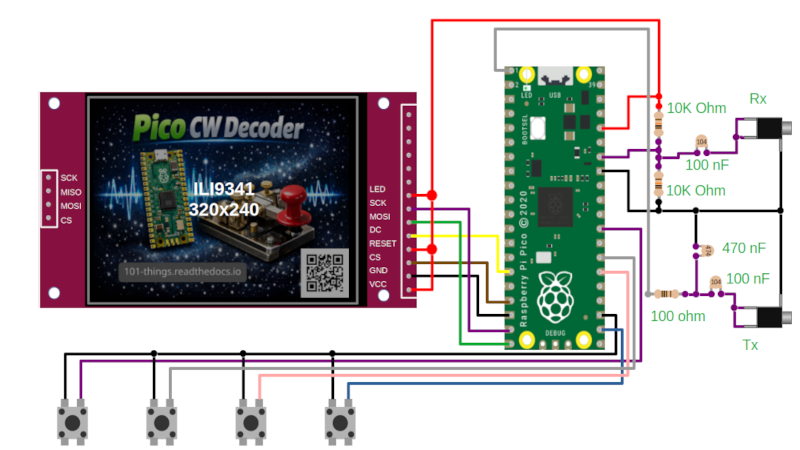

Hamfist – A CW Decoder for Pi Pico
==================================

Features
--------

+ Cheap, Easy Build
+ Minimal External Components
+ Transmit and receive functionality
+ Multi-Channel
+ Bayesian Decoding
+ Autocorrect

Install Arduino Pico
--------------------

The CW Decoder code is written in pure C++, but a demo application is provided as an `Arduino library <https://github.com/dawsonjon/HamFist/tree/main/cw_decoder>`__. The `Arduino Pico <https://github.com/earlephilhower/arduino-pico>`__ port by Earle Philhower is probably the easiest way to install and configure a C++ development environment for the Raspberry Pi Pico. It is possible to install the tool and get up and running with example applications in just a few minutes. Refer to the `installation instructions <https://github.com/earlephilhower/arduino-pico?tab=readme-ov-file#installing-via-arduino-boards-manager>`__ and the `online documentation <https://arduino-pico.readthedocs.io/en/latest/>`__ to get started.

Documentation
-------------

For technical details, refer to the technical `documentation <https://101-things.readthedocs.io/en/latest/ham_fist.html>`_.

3D-Printed Enclosure
--------------------

A 3D printed enclosure can be found `here <https://github.com/dawsonjon/HamFist/tree/main/enclosure>`__, including stl files and FreeCAD design files.

Touch Screen Support
--------------------

Touch screen operation is now supported (for ILI9341 screens incorporating a resistive touch controller).  This includes a full QWERTY touch screen keyboard with autocomplete.

A few extra connections are needed to enable touch screen operation:

 .. image:: images/full_circuit_touch.png

Touch screen operation can be enabled by setting the `TOUCH` macro to 1.

.. code:: cpp

    #define PIN_MISO     12 //not used by TFT but part of SPI bus
    #define PIN_CS       13
    #define PIN_CS_TOUCH 10
    #define PIN_SCK      14
    #define PIN_MOSI     15
    #define PIN_DC       11
    #define SPI_PORT     spi1

    ////////////////////////////////////////////////////////////////////////
    #define TOUCH        0 //Set this to 1 if you have touch screen hardware
    ////////////////////////////////////////////////////////////////////////

    //#define ROTATION R0DEG
    //#define ROTATION R90DEG
    //#define ROTATION R180DEG
    #define ROTATION R270DEG
    //#define ROTATION MIRRORED0DEG
    //#define ROTATION MIRRORED90DEG
    //#define ROTATION MIRRORED180DEG
    //#define ROTATION MIRRORED270DEG

    //#define INVERT_COLOURS false
    #define INVERT_COLOURS true

    #define INVERT_DISPLAY false
    //#define INVERT_DISPLAY true

    #define DISPLAY_TYPE 0 //ILI934x 320x240 TFT DIsplay
    //#define DISPLAY_TYPE 1 //ILI934x (driver 2) 320x240 TFT DIsplay

Once enabled follow on-screen instructions to calibrate touch controller.

Automated PTT Switching
-----------------------

The firmware now includes automatic Transmit control using the transceiver's PTT input. PTT switching can be enabled using the following circuit.

 .. image:: images/ptt_circuit.png

Credits
-------

This project uses the ILI934X display driver by Darren Horrocks.
